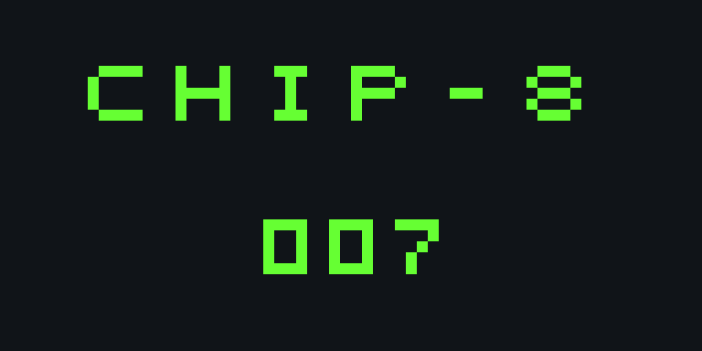

# CHIP-8 Emulator


A CHIP-8 interpreter in modern C++ (C++20). It implements the standard CHIP-8 instruction set, has switchable compatibility quirks, and comes in two frontends: an SDL2 window with keyboard and sound, and a headless runner that prints the screen as text.



*The included demo ROM (`roms/demo.ch8`) drawing a banner and a counter that ticks up twice a second.*

## What CHIP-8 is

CHIP-8 is a tiny virtual machine from the 1970s, designed so games could run on different hobby computers. It has 4 KB of memory, sixteen 8-bit registers, a 64x32 monochrome screen, a 16-key hex keypad, two 60 Hz timers, and about 35 two-byte instructions. It's the usual first emulator to write, because it covers the same pieces as a real console emulator (fetch/decode/execute, memory, graphics, input, timing) at a size you can hold in your head.

## Features

- **The full standard instruction set**, including drawing with XOR and collision detection, BCD conversion, the built-in hex font, and wait-for-key.
- **Compatibility quirks.** Interpreters from the 70s, 80s and 90s disagree on a few instructions (shifts, `FX55`/`FX65`, `BNNN`, and whether logic ops reset `VF`). ROMs were written against different ones, so each behavior is a flag in `chip8::Quirks`. `--vip` switches to original COSMAC VIP behavior.
- **Instruction speed decoupled from timers.** The CPU runs at a configurable rate (700 instructions/second by default) while the delay and sound timers tick at a fixed 60 Hz, using an accumulator so it behaves the same on a 60 Hz or 144 Hz monitor.
- **Faults are errors, not crashes.** Stack overflow and underflow, out-of-range memory access, unknown opcodes, and `0NNN` machine-code calls throw a `Chip8Error` with the opcode and address, instead of reading garbage memory.
- **Core with no I/O.** `chip8core` has no SDL, file, or console code, so it's straightforward to test and would drop into a different frontend (web, libretro, and so on).

## Build

Requires CMake 3.20+ and a C++20 compiler. SDL2 is optional: without it, only the headless runner and tests are built.

```bash
# Linux: sudo apt install libsdl2-dev     macOS: brew install sdl2
cmake -S . -B build
cmake --build build
ctest --test-dir build --output-on-failure
```

## Run

```bash
./build/chip8 roms/demo.ch8              # window, keyboard, beep
./build/chip8 some_game.ch8 --speed 1000 --scale 16 --vip

./build/chip8-headless roms/demo.ch8 --cycles 3000   # prints the screen as # and .
```

Keypad mapping, the layout most emulators use:

```
Keyboard        CHIP-8
1 2 3 4         1 2 3 C
Q W E R    ->   4 5 6 D
A S D F         7 8 9 E
Z X C V         A 0 B F
```

## Tests

`tests/test_chip8.cpp` has 26 opcode-level tests with no framework dependency. Each loads a few instructions and checks registers, memory, the screen, and flags. They cover:

- carry/borrow flags, including when `VF` is itself the destination register
- both shift behaviors, both `BNNN` behaviors, and the VIP `VF` reset
- sprite drawing, collision, clipping at the screen edge, and wrapping of the start position
- `FX0A` blocking until a key is *released*, not just pressed
- timers never going below zero
- every error path: stack overflow, stack underflow, unknown opcodes, out-of-range memory

CI builds and tests on Linux, macOS and Windows, plus a separate run with AddressSanitizer and UndefinedBehaviorSanitizer.

## The demo ROM

`roms/demo.ch8` is original (not a copyrighted game). `tools/make_demo_rom.py` builds it with a small two-pass assembler, so you can read the source instead of a hex dump. It uses CALL/RET, the delay timer, BCD, register load/store, the font, and XOR drawing: the counter is erased by drawing it a second time.

To try real games, look up public-domain CHIP-8 ROM collections, or test suites such as Timendus's `chip8-test-suite`.

## Layout

```
include/chip8/Chip8.hpp   public interface + Quirks
src/Chip8.cpp             the interpreter
src/main_sdl.cpp          SDL2 frontend (window, input, audio, 60 Hz timing)
src/main_headless.cpp     text-mode runner
tests/test_chip8.cpp      opcode tests
tools/make_demo_rom.py    assembler for the demo ROM
```

## Next steps

- SUPER-CHIP and XO-CHIP extensions (128x64 hi-res mode, scrolling, extra memory)
- Save states (the whole machine state is a few KB, so it's just a struct copy)
- A step debugger that shows registers and disassembly
- A libretro core
